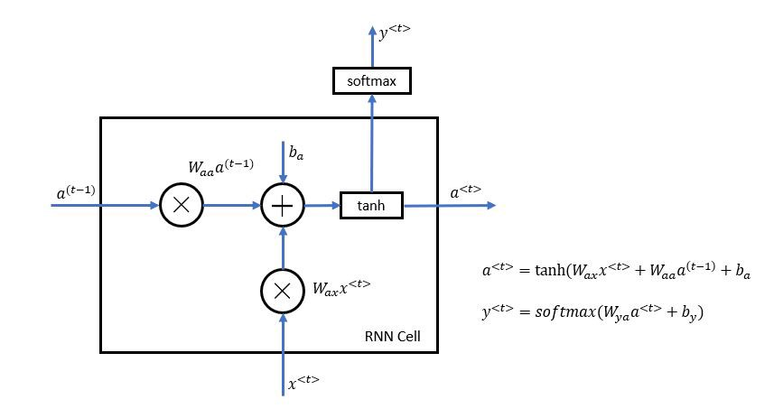
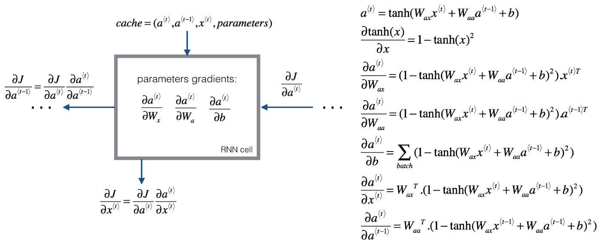
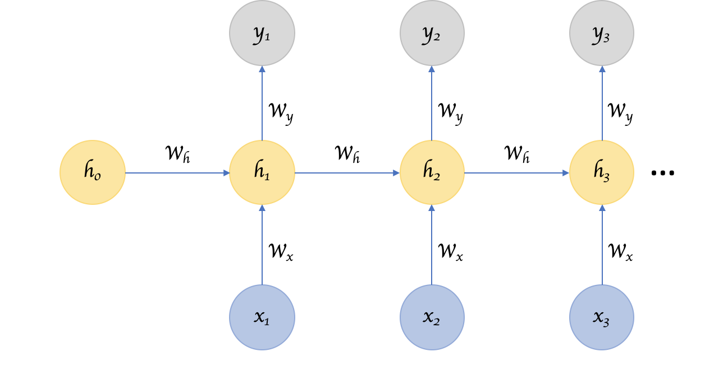
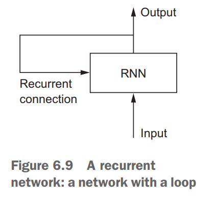

# Recurrent Neural Networks

## Notes

> RNNs are designed to take a series of input with no predetermined limit on size

### Implementation in python

[rnn from scratch](https://medium.com/x8-the-ai-community/building-a-recurrent-neural-network-from-scratch-f7e94251cc80)



```python
def rnn_cell_forward(xt, a_prev, parameters): # Look at rnn_forward_pass
    Wax = parameters["Wax"]
    Waa = parameters["Waa"]
    Wya = parameters["Wya"]
    ba = parameters["ba"]
    by = parameters["by"]
    
    a_next = np.tanh(np.dot(Wax, xt) + np.dot(Waa, a_prev) + ba);
    yt_pred = softmax(np.dot(Wya, a_next) + by);   
    
    cache = (a_next, a_prev, xt, parameters)
    
    return a_next, yt_pred, cache
```



```python
def rnn_cell_backward(da_next, cache): # Look at rnn_backward_pass
    (a_next, a_prev, xt, parameters) = cache
    Wax = parameters["Wax"]
    Waa = parameters["Waa"]
    Wya= parameters["Wya"]
    ba= parameters["ba"]
    by= parameters["by"]
    dtanh = (1 - a_next * a_next) * da_next
    dWax = np.dot(dtanh, xt.T)
    dxt = np.dot(Wax.T, dtanh)
    dWaa = np.dot(dtanh, a_prev.T)
    da_prev = np.dot(Waa.T, dtanh)
    dba = np.sum(dtanh, keepdims=True, axis=-1)
    gradients = {"dxt": dxt, "da_prev": da_prev,"dWax": dWax, "dWaa": dWaa, "dba": dba}
    return gradients

```


## Links

[rnn in tensorflow](https://www.kdnuggets.com/2016/06/recursive-neural-networks-tensorflow.html)

[rnn what's important](https://towardsdatascience.com/recurrent-neural-networks-d4642c9bc7ce)

[rnn from scratch](https://medium.com/x8-the-ai-community/building-a-recurrent-neural-network-from-scratch-f7e94251cc80)

[rnn sequencial models andrew ng](https://github.com/gyunggyung/Sequence-Models-coursera/blob/master/Week%201/Building%20a%20Recurrent%20Neural%20Network%20-%20Step%20by%20Step/Building%2Ba%2BRecurrent%2BNeural%2BNetwork%2B-%2BStep%2Bby%2BStep%2B-%2Bv3.ipynb)

## Architechture





