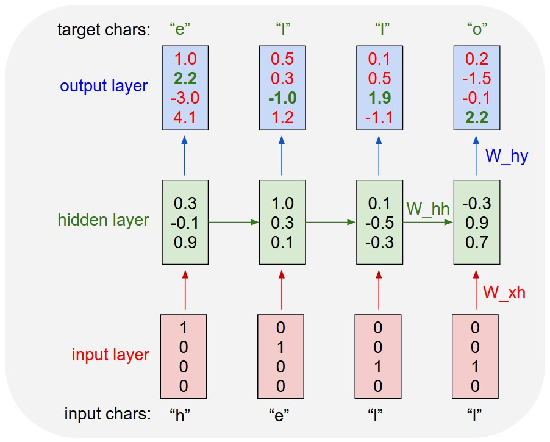
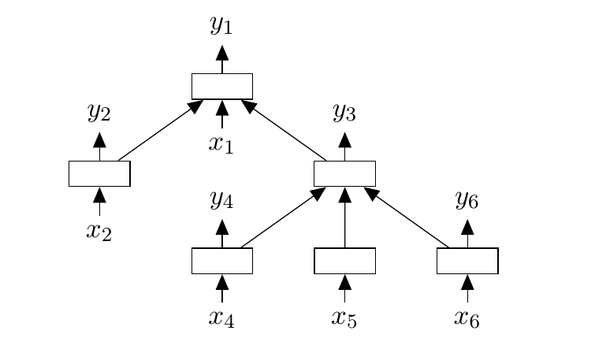

# Recurrent Neural Networks

## Notes

> RNNs are designed to take a series of input with no predetermined limit on size

### Implementation in python

[rnn from scratch](https://medium.com/x8-the-ai-community/building-a-recurrent-neural-network-from-scratch-f7e94251cc80)


```python
def rnn_cell_forward(xt, a_prev, parameters): # Look at rnn_forward_pass
    Wax = parameters["Wax"]
    Waa = parameters["Waa"]
    Wya = parameters["Wya"]
    ba = parameters["ba"]
    by = parameters["by"]
    
    a_next = np.tanh(np.dot(Wax, xt) + np.dot(Waa, a_prev) + ba);
    yt_pred = softmax(np.dot(Wya, a_next) + by);   
    
    cache = (a_next, a_prev, xt, parameters)
    
    return a_next, yt_pred, cache
```


```python
def rnn_cell_backward(da_next, cache): # Look at rnn_backward_pass
    (a_next, a_prev, xt, parameters) = cache
    Wax = parameters["Wax"]
    Waa = parameters["Waa"]
    Wya= parameters["Wya"]
    ba= parameters["ba"]
    by= parameters["by"]
    dtanh = (1 - a_next * a_next) * da_next
    dWax = np.dot(dtanh, xt.T)
    dxt = np.dot(Wax.T, dtanh)
    dWaa = np.dot(dtanh, a_prev.T)
    da_prev = np.dot(Waa.T, dtanh)
    dba = np.sum(dtanh, keepdims=True, axis=-1)
    gradients = {"dxt": dxt, "da_prev": da_prev,"dWax": dWax, "dWaa": dWaa, "dba": dba}
    return gradients

```

## Recursive vs recurrent

**Recurrent Neural networks** are recurring over time. For example if you have a sequence

x = ['h', 'e', 'l', 'l']

This sequence is fed to a single neuron which has a single connection to itself.

At time step 0, the letter 'h' is given as input at time step 1, 'e' is given as input. The network when unfolded over time will look like this.



A **recursive network** is just a generalization of a recurrent network. In a recurrent network the weights are shared (and dimensionality remains constant) along the length of the sequence because how would you deal with position-dependent weights when you encounter a sequence at test-time of different length to any you saw at train-time. In a recursive network the weights are shared (and dimensionality remains constant) at every node for the same reason.

This means that all the W\_xh weights will be equal(shared) and so will be the W\_hh weight. This is simply because it is a single neuron which has been unfolded in time.



It is quite simple to see why it is called a Recursive Neural Network. Each parent node's children are simply a node similar to that node.

[source](https://stats.stackexchange.com/questions/153599/recurrent-vs-recursive-neural-networks-which-is-better-for-nlp)

## Links

[rnn in tensorflow](https://www.kdnuggets.com/2016/06/recursive-neural-networks-tensorflow.html)

[rnn what's important](https://towardsdatascience.com/recurrent-neural-networks-d4642c9bc7ce)

[rnn from scratch](https://medium.com/x8-the-ai-community/building-a-recurrent-neural-network-from-scratch-f7e94251cc80)

[rnn sequencial models andrew ng](https://github.com/gyunggyung/Sequence-Models-coursera/blob/master/Week%201/Building%20a%20Recurrent%20Neural%20Network%20-%20Step%20by%20Step/Building%2Ba%2BRecurrent%2BNeural%2BNetwork%2B-%2BStep%2Bby%2BStep%2B-%2Bv3.ipynb)

## Architechture


